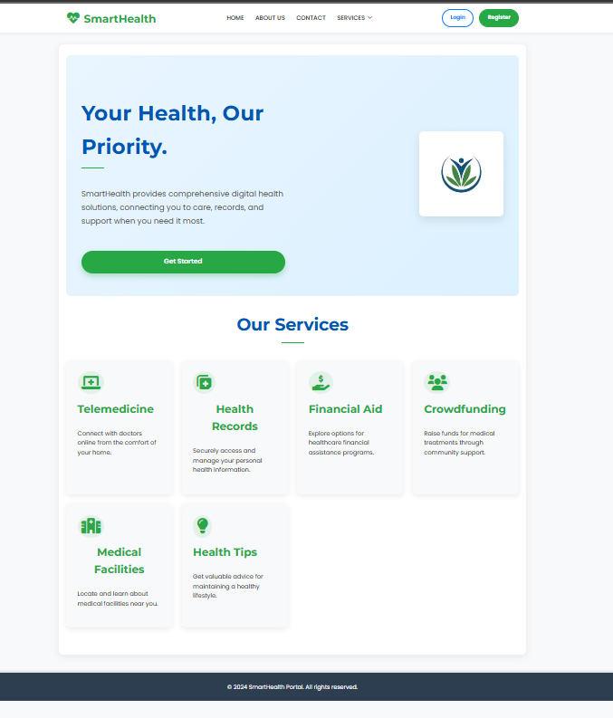

# Health-Finance-Portal
A full-stack Smart Health and Finance Assistance Portal built with Spring Boot and MySQL for the backend. It enables users to manage their health data, track finances, and analyze trends through an intuitive web interface.It is an user-centric web platform designed to streamline **health** and **finance** management for individuals. Built using **Spring Boot** and this portal aims to simplify daily healthcare tracking, financial aid access, medical record management, and more.

---

## 🚀 Features

### 🩺 Health Module
- Digital Health Records Management
- Health Tips & Awareness
- Appointment Scheduling (Telemedicine)
- Facility Search (Clinics, Labs, Hospitals)

### 💸 Finance Module
- Crowdfunding Campaigns
- Apply for Financial Aid
- Track Fund Status
- Financial Tips and Support

### 👤 User Management
- Secure Login & Registration
- Role-Based Access (Admin/User)
- Profile Management

---

## 📂 Tech Stack

| Layer         | Technology           |
|---------------|----------------------|
| Frontend      | HTML/CSS, JavaScript |
| Backend       | Spring Boot (Java)   |
| Database      | MySQL  |
| Security      | Spring Security with JWT |
| Build Tool    | Maven                |

---

## 📸 Preview


## 🖼 Homepage Preview




---

## ⚙️ How to Run Locally

### 🔧 Prerequisites
- Java 17+
- Maven
- MySQL (if using MySQL DB)

### 💻 Steps

```bash
# Clone the repository
git clone https://github.com/shubhangik04/Health-Finance-Portal.git
cd Health-Finance-Portal

# Install dependencies and run the Spring Boot app
mvn clean install
mvn spring-boot:run

